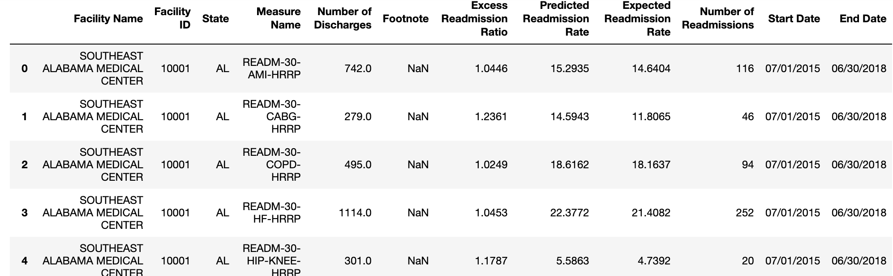
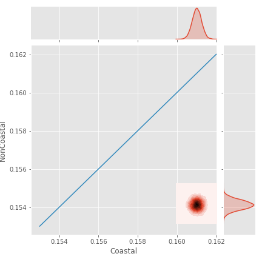
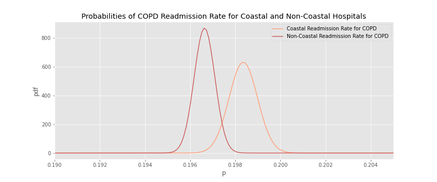
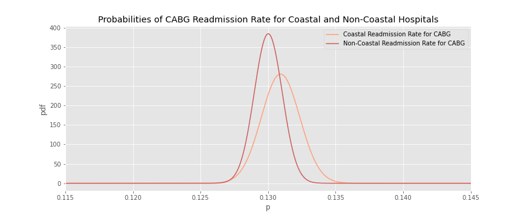
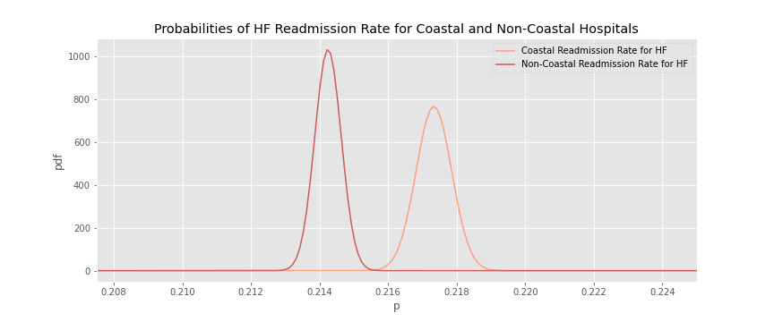
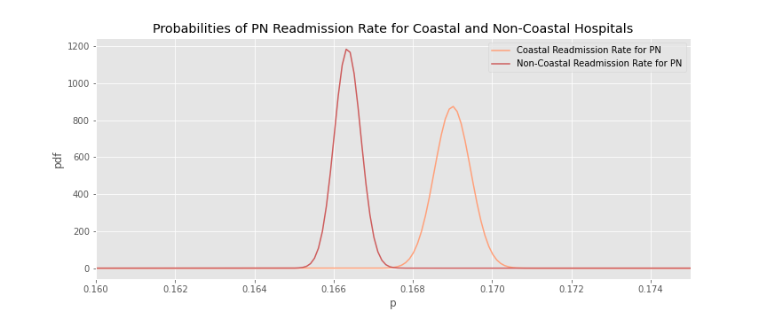

# National Hospital Readmission

## Background & Motivation

Medicare implemented the Hopital Readmissions Reduction Program (HRRP) which is a program that encourages hospitals to improve communication and care requirements to assist patients and caregivers in rehabilitation after being discharged, or realeased from the hospital. The 21st Century Cures Act directs the Centers for Medicare & Medicaid Services (CMS) to evaluate a hospital's readmission rate compared to hospitals with a similar proportion of patients eligible for Medicare and Medicaid benefits. 

There are six conditions/procedures measured in the program:
* Acute myocardial infarction (AMI)
* Chronic obstructive pulmonary disease (COPD)
* Heart failure (HF)
* Pneumonia
* Coronary artery bypass graft (CABG) surgery
* Elective primary total hip arthroplasty and/or total knee arthroplasty (THA/TKA)

I became interested in the rates at which hospitals are readmitting patients from watching my aunt and uncle struggle with intense cargiving plans after being discharged from the hospital and seeing my uncle be readmitted to the hospital repeatedly. I wanted to know how readmission varied over the country and through different hospitals. 

## The Data

The federal government has a website, managed by the Centers for Medicare & Medicaid Servies, that provides a large dataset of 3,224 hospitals nation-wide. It lists metrics for discharge (being released from the hospital) and readmission (being readmitted to the hospital) for each of the six conditions that had high risk of readmission, mentioned previously. Some of the key features that I used to analyize the data were facility name, state, measure, number of discharges, and number of readmissions. The data was collected over a three-year period from July 1st 2015 to June 30th 2018.

## Data Cleaning

While looking at the data, I noticed that there were several missing rows for number of discharges and number of readmissions. I also realized, upon further analysis that what I initially thought to be integers were actually strings. So my first actions were to convert non-numbers in the 'Number of Discharges' and 'Number of Readmissions' to zero, and to make sure these rows were all integers rather than strings so that I could start expoloring my data. 

## Exploratory Data Analysis

My first question when looking at this data was how readmission varied between the six conditions. To answer this I plotted the total number of readmissions over the number of discharges for each different condition. The results, shown below indicate that heart failure and chronic obstructive pulmonary disease have the highest readmission numbers compared to discharges. This indicates that perhaps there is room for improvement in the assistence for patients and caregivers being discharged for either of these two conditions. 

My second question was how readmission rate for coastal hospitals compared to non-coastal hospitals. There is a slight difference between the two, showing a higher readmission rate for coastal hospitals. 

## Bayesian A/B Test

This is a very large dataset with several hospitals in each state. There are many factors that may contribute to being readmitted to a hospital, and I wanted to know if those factors were influenced by being a hospital on the coast. I believe that population density is highest on the coasts, and in additon, many well-known universities, particularly for higher education in the medical field tend to be closer to the coasts. Based on this belief, I hypothesized that coastal hospitals would see a lower probability of readmission rate. I suspected that many graduates of medical school would choose to remain located closer to where they graduated and therefore you would see more competition and better doctors on the coast, leading to a lower readmission rate. 

In order to test my hypothesis I set up a Bayesian A/B test, testing coastal versus non-coastal hospitals. I defined my coastal states as any state with land touching the ocean, which led me to a list of 19 states. Variation A was coastal states, and variation B was non-coastal states. The first step was to come up with my priors, which I defined as one. I then calculated my posterior parameters, and plotted my beta distribution. The final plot can be seen below, indicating that my hypothesis was incorrect, and that variation b - non-coastal states had a lower probability of readmission.  

I then plotted a joint probability distribution of variation A - coastal, vs variation B - non-coastal. This shows the probability density of coastal compared to non-coastal hospitals. The line down the middle indicates that the probability of readmission is much higher for coastal hospitals because the color is dense on coastal side of the line. 

After completing the A/B test on the total hospitals for coastal versus non-coastal, I decided I wanted to know if it mattered whether you went to a coastal versus non-coastal hospital depending on what condition you had. So I completed a Bayesian A/B test for each condition, which are plotted below.

The first plot is for the condition AMI (Heart Attack). Similarly to the total of all of the conditions, it suggests that your probability of being readmitted for issues concering a heart attack after being discharged, are lower in non-coastal hospitals. This is true for heart failure, chronic obstructive pulmonary disease and pneumonia as well. Coronary artery bypass graft surgery, elective primary total hip arthroplasty and/or total knee arthroplasty each have much more overlapping graphs meaning more uncertainty as to which has a lower probability of readmission. So despite the fact that overall the data suggests that going to a non-coastal hospital may be the better route in decreasing your probability of readmission, depending on what condition you are being discharged for, the decision may change.

## Conclusion

Based on the result of my Bayesian A/B test, and exploratory data, I would suggest that a patient and caregiver be thoughtful about deciding whether their condition has a lower rate of discharge in a coastal or non-coastal region. The consequences of being readmitted can be very severe, so getting the necessary help in transitioning out of the hospital to day to day life, is very important. I think this data would be helpful in making a decision about where to be admitted. 

## Citations

* [Data](https://data.medicare.gov/Hospital-Compare/Hospital-Readmissions-Reduction-Program/9n3s-kdb3?fbclid=IwAR2E669uUTZXvrRhk9qrqs73Rbj1OC6Ex17tzg0XD8OqMixJOas3HudS1nM)

* [Joint Probability Distribution](https://towardsdatascience.com/bayesian-a-b-testing-with-python-the-easy-guide-d638f89e0b8a)

* [Bayesian A/B Testing Whitepaper](https://vwo.com/downloads/VWO_SmartStats_technical_whitepaper.pdf)

* [John's Hopkins Image](https://hub.jhu.edu/2013/07/16/us-news-hospital-rankings/)